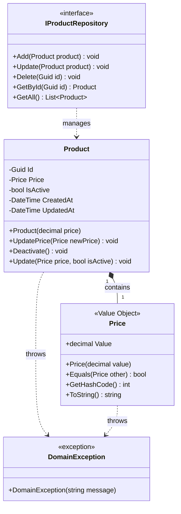
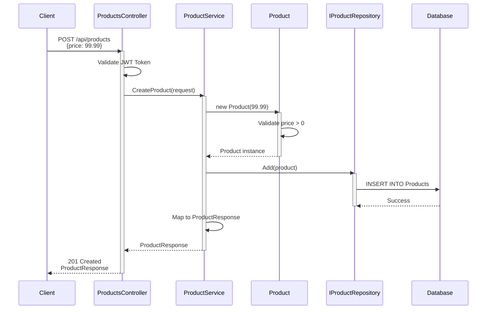
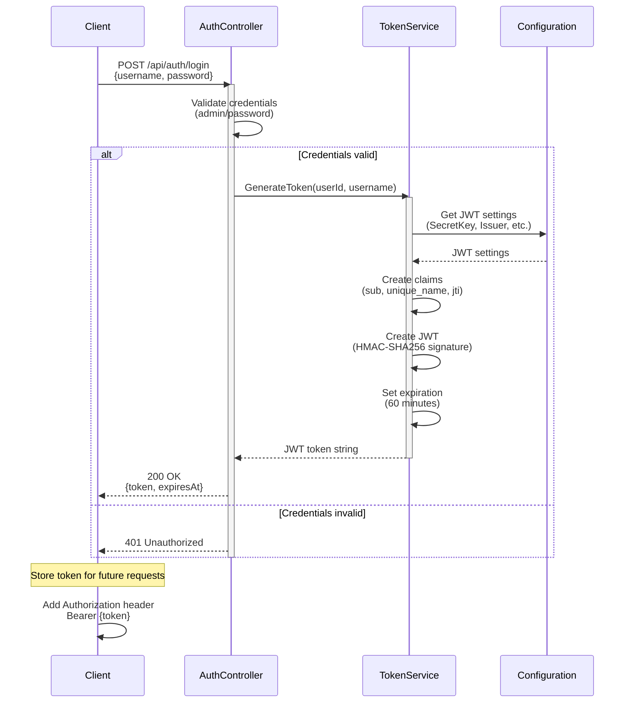
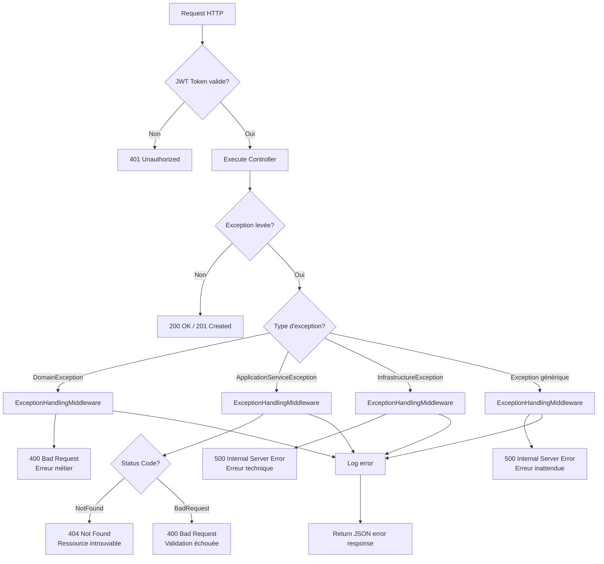
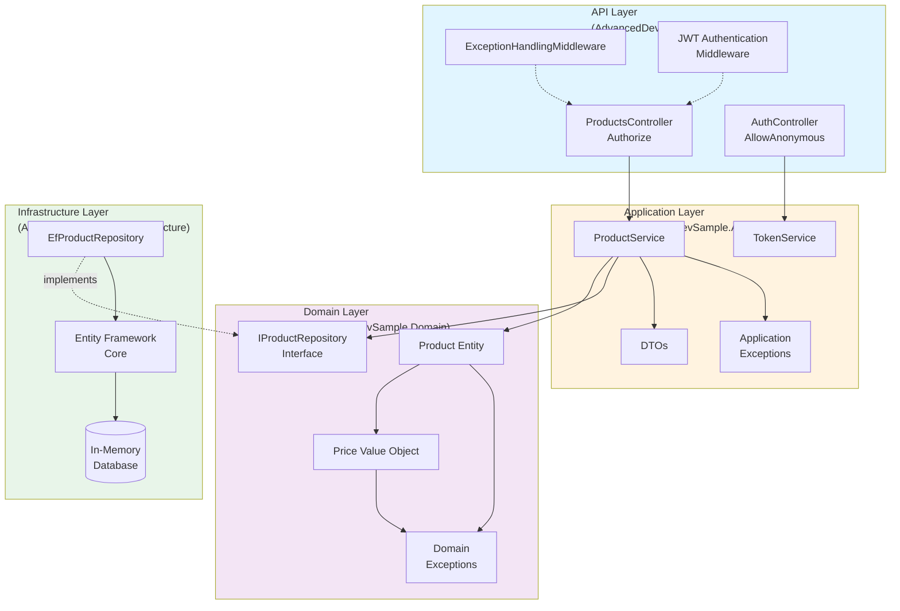
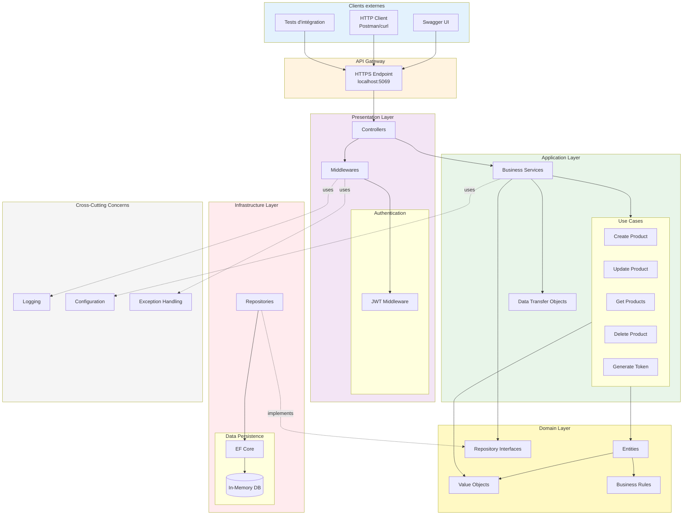
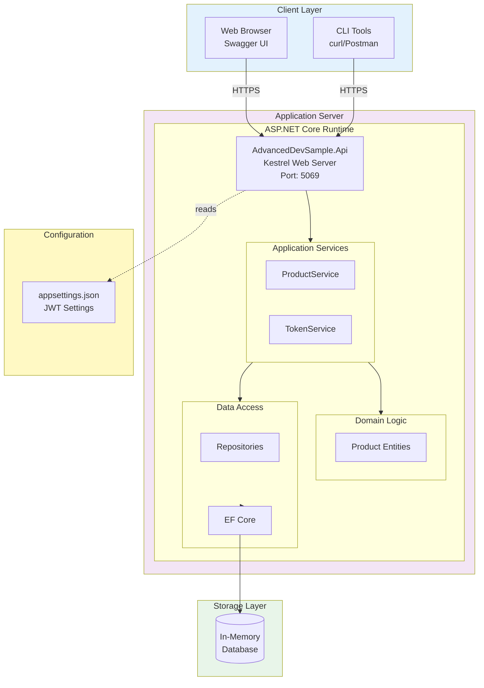
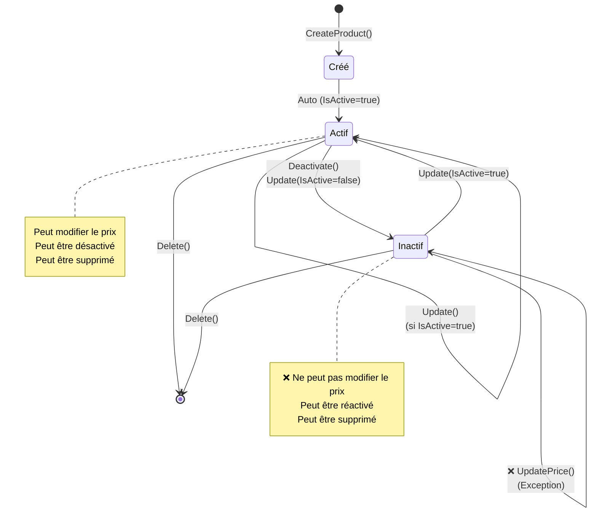
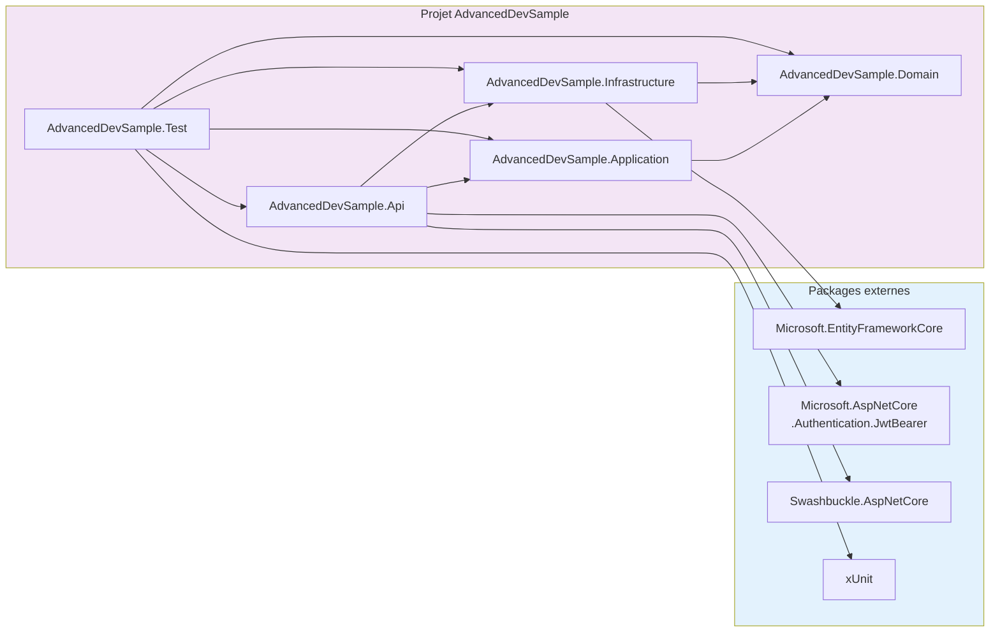

# Diagrammes du projet AdvancedDevSample

Ce document contient les diagrammes visuels du projet au format Mermaid.
Vous pouvez les visualiser directement sur GitHub ou avec n'importe quel outil compatible Mermaid.

## Table des matières

1. [Diagramme de classes - Domaine](#diagramme-de-classes---domaine)
2. [Diagramme de séquence - Création de produit](#diagramme-de-séquence---création-de-produit)
3. [Diagramme de séquence - Authentification JWT](#diagramme-de-séquence---authentification-jwt)
4. [Diagramme de flux - Gestion des erreurs](#diagramme-de-flux---gestion-des-erreurs)
5. [Diagramme de composants](#diagramme-de-composants)
6. [Diagramme d'architecture](#diagramme-darchitecture)

---

## Diagramme de classes - Domaine

---

## Diagramme de séquence - Création de produit

---

## Diagramme de séquence - Authentification JWT

---

## Diagramme de flux - Gestion des erreurs

---

## Diagramme de composants

---

## Diagramme d'architecture

---

## Diagramme de déploiement (Architecture de déploiement)

---

## Diagramme d'état - Cycle de vie d'un produit

---

## Diagramme de package - Dépendances

---

## Comment visualiser ces diagrammes

### Sur GitHub
Les diagrammes Mermaid sont automatiquement rendus sur GitHub dans les fichiers Markdown.

### En local avec VS Code
1. Installez l'extension "Markdown Preview Mermaid Support"
2. Ouvrez ce fichier
3. Utilisez Ctrl+Shift+V (Cmd+Shift+V sur Mac) pour prévisualiser

### En ligne
1. Copiez le code d'un diagramme
2. Allez sur [Mermaid Live Editor](https://mermaid.live/)
3. Collez le code pour le visualiser et l'exporter

### Avec JetBrains Rider
Rider supporte nativement Mermaid dans les fichiers Markdown.

---

**Date de création** : 9 février 2026  
**Version** : 1.0  
**Auteur** : AdvancedDevSample Team

